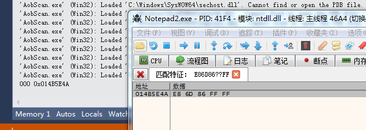
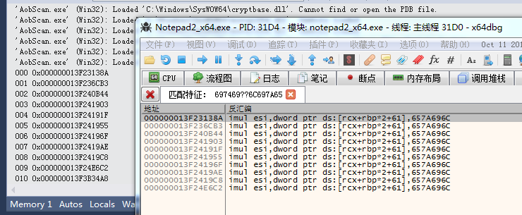

##### 简介

搜索算法，速度很快，支持通配符。同是支持32位和64位程序。

来自

x64跨进程aob搜索

https://bbs.pediy.com/thread-247517.htm

##### 环境

Windows、VS2013


##### 修改说明

- 1.修改接口，修复内存泄露

- 2.修复64位无法读取内存

- 3.添加x32和x64的地址控件限制


##### DemoX32

```c++
	std::vector <DWORD> vResultContainer = AobScan::FindSigX32(6580, "E86D86??FF", 0, 0x7fffffff);
	int nSize1 = 0;
	for (auto it = vResultContainer.begin(); it != vResultContainer.end();it++)
	{
		wchar_t buf[64] = { 0 };
		wsprintf(buf, L"%03d 0x%08X\n", nSize1, *it);
		OutputDebugString(buf);
		nSize1++;
	}
```

在Notepad2 4.2.25中搜索E86D86??FF的结果，右侧的是X32dbg结果




##### DemoX64

```c++
	std::vector <ULONG64> dwRet = AobScan::FindSigX64("697469??6C697A65", 5648,0x77111000, -1);
	int nSize2 = 0;
	for (auto it = dwRet.begin(); it != dwRet.end(); it++)
	{
		wchar_t buf[64] = { 0 };
		wsprintf(buf, L"%03d 0x%016I64X\n", nSize2, *it);
		OutputDebugString(buf);
		nSize2++;
	}
```


DemoX64结果

在Notepad2 4.2.25中搜索697469??6C697A65的结果，右侧的是X64dbg结果




##### 可优化项说明

- 搜索段与段之间会漏掉一些匹配项，自己去改。

- 重复内存分配和释放


